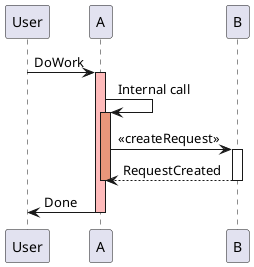

### Sequence Diagram



### AWS Diagram

```plantuml

@startuml Figure 1

' title Figure 1. High-level architecture diagram
' https://aws.amazon.com/blogs/architecture/sequence-diagrams-enrich-your-understanding-of-distributed-architectures/

!define AWSPuml https://raw.githubusercontent.com/awslabs/aws-icons-for-plantuml/v14.0/dist
!include AWSPuml/AWSCommon.puml
!include AWSPuml/ApplicationIntegration/APIGateway.puml
!include AWSPuml/Compute/LambdaLambdaFunction.puml
!include AWSPuml/Database/DynamoDB.puml
!include AWSPuml/General/User.puml
!include AWSPuml/Groups/AWSCloud.puml
!include AWSPuml/NetworkingContentDelivery/CloudFront.puml
!include AWSPuml/NetworkingContentDelivery/CloudFrontEdgeLocation.puml

' Groups are rectangles with a custom style using stereotype - need to hide
hide stereotype
skinparam linetype ortho
skinparam rectangle {
    BackgroundColor AWS_BG_COLOR
    BorderColor transparent
    Shadowing false
}

!procedure $AWSIcon($service, $line1, $line2="")
rectangle "$AWSImg($service)\n<b>$line1</b>\n$line2"
!endprocedure

' white text in a black box
!procedure $stepnum($number)
<back:black><color:white><b> $number </b></color></back>\n
!endprocedure

$AWSIcon(User, " ", "User") as user
AWSCloudGroup(cloud){
  $AWSIcon(CloudFront, "Web Distribution", "Amazon CloudFront") as cf
  user -r-> cf: $stepnum("1")

  $AWSIcon(CloudFrontEdgeLocation, "Orgin Request", "AWS Lambda@Edge") as edge
  $AWSIcon(DynamoDB, "Version Mappings", "Amazon DynamoDB") as dynamodb
  edge -r-> dynamodb: $stepnum("3")
  cf -u-> edge: $stepnum("2")

  $AWSIcon(APIGateway, "API V1", "Amazon API Gateway") as api1
  $AWSIcon(LambdaLambdaFunction, "    Function V1    ", "AWS Lambda") as lambda1
  edge -[hidden]d- api1
  dynamodb  -[hidden]d- lambda1
  cf -r-> api1: $stepnum("4")
  api1 -r-> lambda1

  $AWSIcon(APIGateway, "API V2", "Amazon API Gateway") as api2
  $AWSIcon(LambdaLambdaFunction, "    Function V2    ", "AWS Lambda") as lambda2
  cf -r-> api2
  api1 -[hidden]d- api2
  lambda1 -[hidden]d- lambda2
  api2 -r-> lambda2
}

@enduml
```

```plantuml
@startuml Figure 3

' title Figure 3. API version not found
' https://aws.amazon.com/blogs/architecture/sequence-diagrams-enrich-your-understanding-of-distributed-architectures/

!define AWSPuml https://raw.githubusercontent.com/awslabs/aws-icons-for-plantuml/v14.0/dist
!include AWSPuml/AWSCommon.puml
!include AWSPuml/ApplicationIntegration/APIGateway.puml
!include AWSPuml/Compute/LambdaLambdaFunction.puml
!include AWSPuml/Database/DynamoDB.puml
!include AWSPuml/General/User.puml
!include AWSPuml/Groups/AWSCloud.puml
!include AWSPuml/NetworkingContentDelivery/CloudFront.puml
!include AWSPuml/NetworkingContentDelivery/CloudFrontEdgeLocation.puml

hide footbox
skinparam style strictuml

skinparam participant {
    BackgroundColor AWS_BG_COLOR
    BorderColor AWS_BORDER_COLOR
    RoundCorner 0
}
skinparam sequence {
    ArrowThickness 2
    LifeLineBorderColor AWS_COLOR
    LifeLineBackgroundColor AWS_BORDER_COLOR
    BoxBorderColor AWS_COLOR
    MessageAlignment left
}
skinparam NoteTextAlignment left
skinparam NoteBorderColor AWS_COLOR
skinparam NoteBackgroundColor #BUSINESS

skinparam shadowing false
skinparam MaxMessageSize 600
skinparam BoxPadding 2
skinparam ParticipantPadding 10

!procedure $AWSIcon($service, $line1, $line2="")
participant "$AWSImg($service)\n<b>$line1</b>\n$line2"
!endprocedure

$AWSIcon(User, " ", "User") as user
$AWSIcon(CloudFront, "Web Distribution", "Amazon CloudFront") as cf
$AWSIcon(CloudFrontEdgeLocation, "Orgin Request", "AWS Lambda@Edge") as edge <<nodejs14.x>>
$AWSIcon(DynamoDB, "Version Mappings", "Amazon DynamoDB") as dynamodb <<on-demand>>

user -> cf: GET /hello\nHost: {distribution}.cloudfront.net\nAccept-Version: V3
activate user #white

activate cf AWS_COLOR_PURPLE
cf -> edge: handle(event)
activate edge %lighten(AWS_COLOR_PURPLE, 75)

opt version mappings not cached
    edge -> dynamodb: table scan
    activate dynamodb AWS_COLOR_BLUE
    dynamodb --> edge: items
    deactivate dynamodb
    edge -> edge: cache version mappings
end

edge -> edge: lookup API version
note right
  API V3 not found
end note
edge --> cf: cf.response object\nwith status=404 and\ncustom description
deactivate edge
cf --> user: HTTP/1.1 404 API Version Not Found
deactivate cf
deactivate user

@enduml
```

